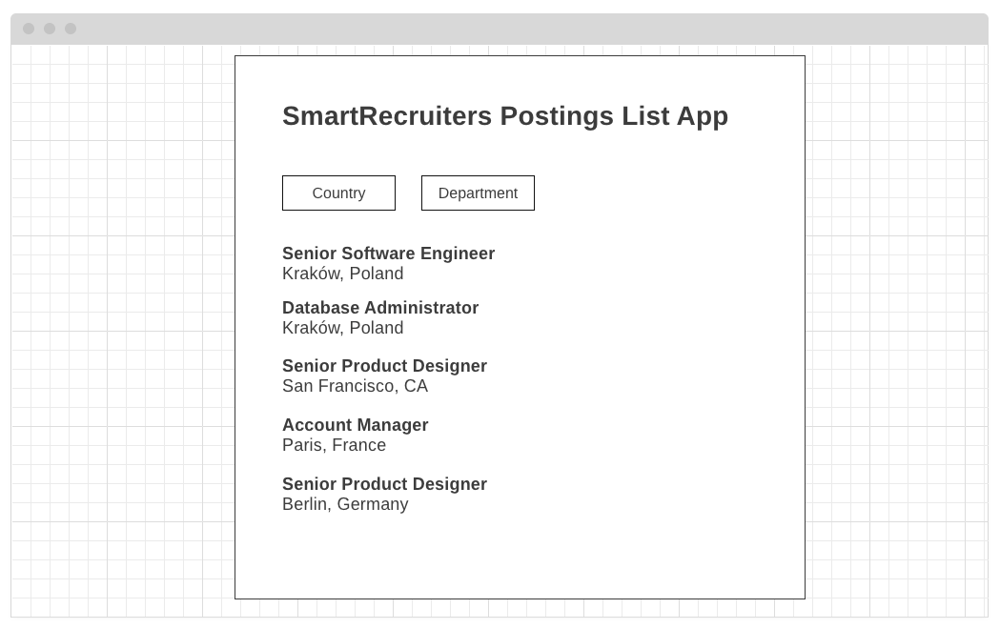

# SmartRecruiters Postings List App 
- [Goal](#goal)
- [User Stories](#user-stories)
- [Scenario](#scenario)
- [Wireframes](#wireframes)
- [Public API](#public-api)

<a name="#goal"></a>
## Goal
Develop production-ready application for candidates that displays a list and details of postings published by Smartrecruiters which are available via [SmartRecruiters Public API](#public-api).

The application should:
- implement [user stories](#user-stories)
- pass [scenario](#scenario)
- follow design guidelines from [wireframes](#wireframes)
- pass [e2e tests](tests/README.md)  

<a name="#user-stories"></a>
## User stories
- as a candidate, I want to see list of postings published by SmartRecruiters   
- as a candidate, I want to filter postings published by SmartRecruiters by `location.country` and `department`
- as a candidate, I want to see `jobAd.sections.jobDescription` and `jobAd.sections.jqualifications` of postings published by SmartRecruiters

<a name="#scenario"></a>
## Scenario
1. Open `localhost:8080`
2. Postings list loads
3. Candidate filter list by country and department
4. List displays only filtered elements
5. Click an item on the list
6. Posting details containing `jobAd.sections.jobDescription` and `jobAd.sections.jqualifications` section opens
7. Click `backlink` to return to the list

<a name="#wireframes"></a>
## Wireframes
### List of postings published by SmartRecruiters


### Posting details contatining `jobAd.sections.jobDescription` and `jobAd.sections.jqualifications` section


<a name="#public-api"></a>
## Public API
### Get list of postings published by SmartRecruiters
```GET  https://api.smartrecruiters.com/v1/companies/smartrecruiters/postings``` 

demo: https://reqbin.com/fjiq2zrg    
documentation: https://dev.smartrecruiters.com/customer-api/posting-api/endpoints/postings/     

### Get posting details
```GET https://api.smartrecruiters.com/v1/companies/smartrecruiters/postings/{postingID}```  

demo: https://reqbin.com/sghcu97n       
documentation: https://dev.smartrecruiters.com/customer-api/posting-api/endpoints/postingcontent/    